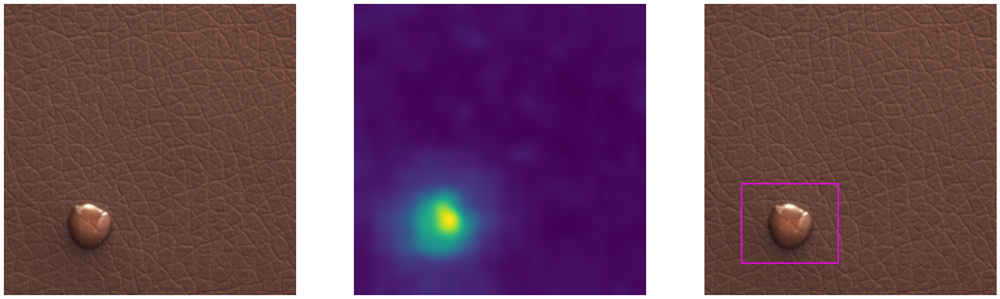
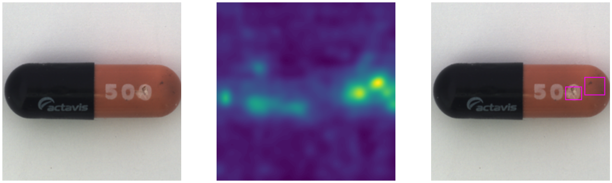
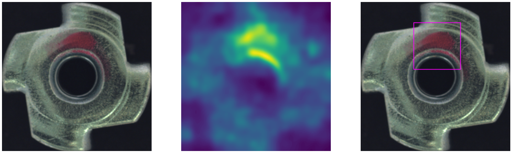

# gaussian-cnn-anomaly-detection

This code is heavily borrowed from `PaDiM-Anomaly-Detection-Localization-master`(https://github.com/xiahaifeng1995/PaDiM-Anomaly-Detection-Localization-master).






## Setup


### Requirements

- Poetry

### Setup venv
```
poetry config virtualenvs.in-project true
poetry run pip install --upgrade pip
poetry install
```
`.venv` directory is created in this project directory and installed Python and packages.

## Run model
Please run below.
```
poetry run python main.py
```